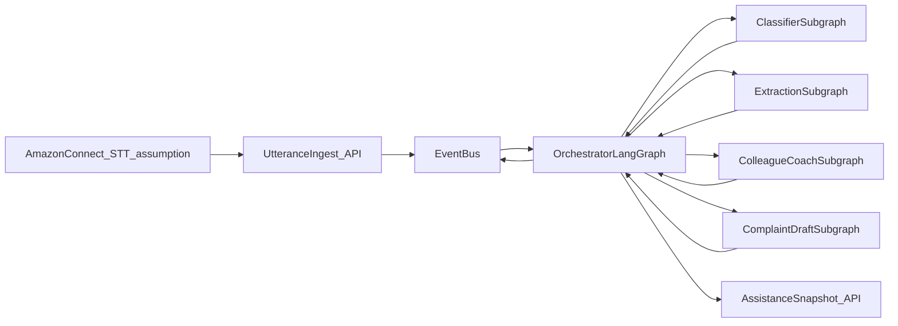
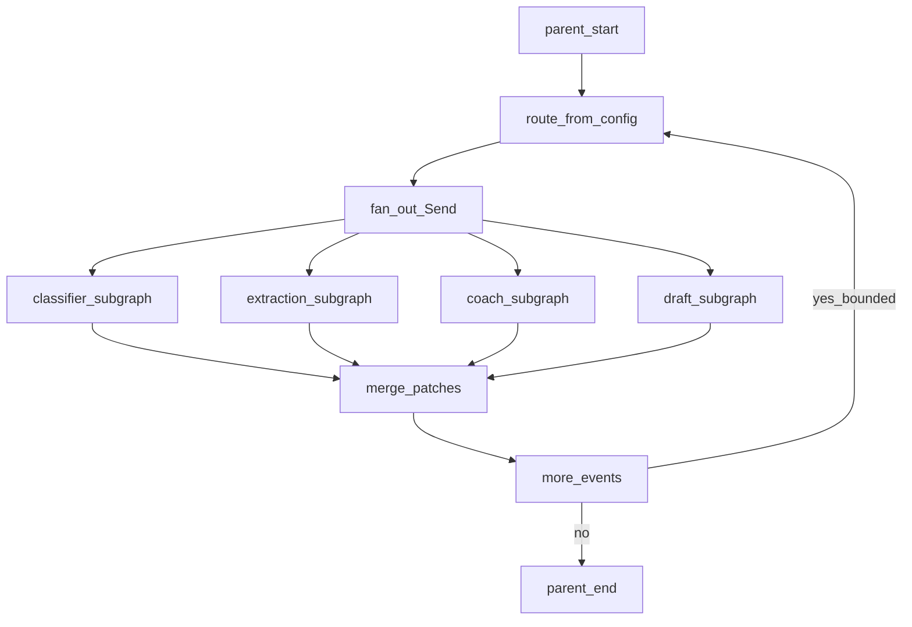

# Agentic contact-centre complaint copilot — architecture v1

Event-driven copilot for bank / financial-services contact-centre colleagues. Amazon Connect is assumed to perform speech-to-text and stream utterances. This layer classifies Query / Concern / Complaint (FCA-style decision tree), coaches the colleague point-in-time, and drafts a log. **No colleague UI** in this repo: assistance is an API read model. **No auto-file:** the colleague confirms.

## Design stances

- Utterances are ingestion events. The orchestrator should mostly react to derived events so filler speech does not trigger an LLM on every chunk.
- Classification is a **tree walk**, not a free-form label. The LLM answers node questions with transcript evidence.
- Labels should be stable (provisional vs confirmed; hysteresis). Do not flip Query → Complaint → Query every two turns.
- The orchestrator **is a LangGraph** (parent). Specialists are compiled subgraphs. One inbound event → one parent invoke. Debounce / STT coalesce stays **outside** the graph (then invoke). The graph does not sleep.



## Product loop (point in time)

An assistance endpoint for a call should return:

1. Live classification — Query / Concern / Complaint, tree path, evidence quotes.
2. Next best question — one or two speakable prompts for the colleague.
3. Draft log — structured fields filling as the call progresses.
4. Confidence / needs confirmation — provisional vs confirmed; override via API.

The customer never talks to our agents.

## System layers

| Layer | Role | Implementation direction |
|---|---|---|
| Ingest | Utterance stream (speaker, text, ts, call_id) | API simulating Connect |
| Normalise | Stitch, speaker, final-utterance filter | Python, no LLM |
| Event bus | Pub/sub | In-process queue first |
| Session store | Per-call state | In-memory by `call_id` |
| Orchestrator | Route, fan-out, merge, emit | Parent LangGraph; routing table from YAML |
| Sub-agents | Specialist graphs | One package per agent |
| Colleague surface | Point-in-time assistance | REST snapshot; no frontend |
| Audit | Why we classified / suggested | Append-only per call |
| Config | Trees, prompts, routing, schemas | YAML under `configs/`, loaded once at process start |

Amazon Connect is outside the system boundary.

## Orchestrator (parent LangGraph)

1. Receive current event + session state.
2. **Route** from YAML: which specialist ids subscribe (and skip rules).
3. **Fan-out** to one or more subgraphs (parallel when the table says so).
4. **Merge** patches into session / assistance snapshot.
5. **Continue or stop:** nested domain events may loop in-graph (bounded hops) or go back to the bus.

Debounce, STT partials, and end-of-customer-turn decide *when* to invoke the parent.

### Inbound events

- `UtteranceReceived`
- `CallStarted` / `CallEnded`

### Internal events (draft catalog)

- `TranscriptUpdated`
- `TreeNodeAnswered`
- `ClassificationChanged` (Query | Concern | Complaint; provisional | confirmed)
- `EntitiesExtracted`
- `SlotsUpdated`
- `GuidanceReady`
- `DraftUpdated`
- `HumanOverride`

### Routing rules (v1 intent)

- Final `UtteranceReceived` → normaliser → `TranscriptUpdated`
- `TranscriptUpdated` → Classifier (debounced; skip tiny / no new customer content)
- `ClassificationChanged` or `TranscriptUpdated` while Concern/Complaint → Extraction
- `SlotsUpdated` or tree says “ask X” → Coach
- Classification to Complaint or slot coverage threshold → Draft
- `CallEnded` → freeze draft + audit bundle
- `HumanOverride` → persist; optionally re-run Coach/Draft only

Fan-out is allowed; assistance snapshots must be merged so consumers do not see competing suggestions.

## Specialists

Shared parent state; each subgraph returns a state patch + events to emit.

1. **Memory** — rolling transcript, speakers, short summary (often no LLM).
2. **Classifier** — walk the FCA tree; evidence + path; explicit “I want to complain” jumps to Complaint.
3. **Extraction** — facts (product, dates, money, desired outcome); does not decide the class.
4. **Coach** — one primary speakable suggestion; suppress repeats until asked or filled.
5. **Draft** — map slots to logging schema; confirm via API, never auto-file.
6. **Policy guard (optional later)** — vulnerability / process flags; keep small until the tree exists.

Out of v1: policy-PDF RAG, real CRM ticketing, live Connect CCP plugin.

## LangGraph shape

- Specialists: own graphs, compiled once at startup, attached as subgraph nodes.
- Parent: `route` → specialist(s) → `merge` → optional bounded re-route.
- Route node **interprets** the YAML table (not a hardcoded specialist chain).
- Orchestrator and specialists can share the same framework base class (working name: BootstrapAgent). Orchestrator `build_graph` is the parent.



## Data contracts (to lock next)

- **Utterance:** `call_id`, `utterance_id`, `speaker`, `text`, `start_ms`, `end_ms`, `is_final`
- **Session:** transcript, classification, tree_cursor, slots, guidance, draft, audit
- **Assistance snapshot:** classification, tree breadcrumb, suggestion, draft, `can_confirm_log`

## Config-driven, load once

YAML in `configs/` is parsed and validated at process start into an in-memory object. Graphs use config slices; they do not re-read files per utterance. Hot-reload is out of scope (restart to pick up changes).

- **YAML:** tree, routing, debounce, prompts, log schema, models, agent enablement.
- **Code:** bus, graph topology, node functions, typed models that mirror config.
- **Env:** secrets and host/port only.

## Framework base agent

Application “bootstrap module” is not the model. A **base class** owns config binding, compile-once, `run` → standard result (`state_patch`, `emit_events`, `audit`), errors, skip rules, trace fields.

Subclasses implement `build_graph` (and optional `handles` / `pre_run` / `post_run`).

**New specialist:** agent YAML + subclass + register + orchestrator routing row. The parent graph does not grow a new hardcoded node type.

Registry: instantiate and compile enabled agents at startup. Parent attaches subgraphs at compile time; route node uses YAML at run time.

Do not conflate: config load + API lifespan vs registry compile vs base-class behaviour vs parent-graph routing vs bus debounce.

## Repository layout

Python packages only (no frontend).

```text
configs/                 # domain YAML, loaded once at startup
  fca/
  agents/
  prompts/
src/ai_layers/
  config/                # load + validate YAML
  api/                   # ingest + assistance snapshot
    routes/
  ingest/
  events/
  orchestrator/          # parent LangGraph
  state/
  agents/
    base/                # framework base class
    registry/
    memory/
    classifier/
    extraction/
    coach/
    draft/
  llm/
  audit/
tests/
  unit/
  integration/
  fixtures/
evals/                   # quality evals, not unit tests
  datasets/
  cases/
  runners/
  reports/               # generated locally
docs/                    # this architecture
```

**Tests** vs **evals:** tests cover wiring (config load, routing, debounce). Evals score classification, next question, and draft quality on labelled calls. Same graphs; evals are not on the production path.

**Boundaries**

- `src/ai_layers/config` must not import agents.
- Process start: load YAML, compile parent + subgraphs, mount API.
- Debounce lives with ingest / event bus, then invokes the parent graph.

## Still to design

1. FCA tree as YAML (node id, question, children, terminals).
2. Per-node resolution: deterministic vs LLM vs hybrid.
3. Complaint / query / concern logging fields.
4. Debounce and coach “don’t nag” rules.
5. Eval cases: labelled streams → expected label and next question.
